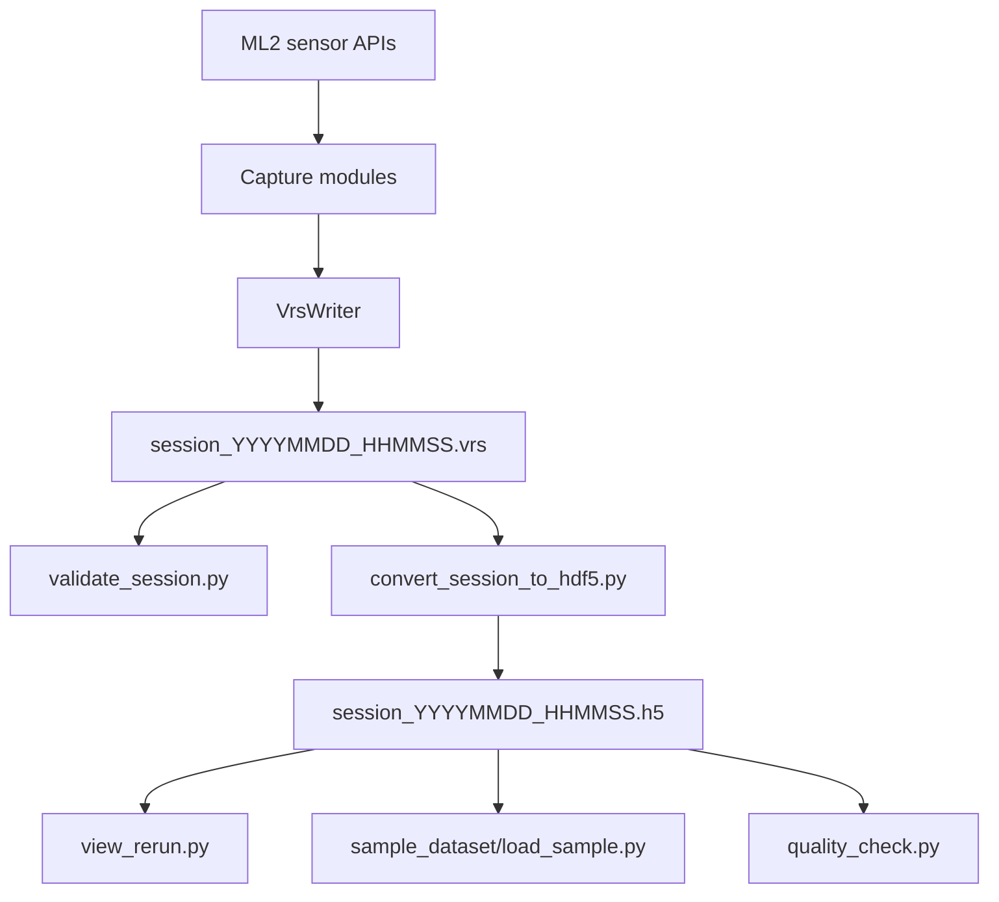

# Data Schema

`ml2-recorder` writes one VRS file per capture session. Host-side tools validate
that VRS file and convert it into a frame-aligned HDF5 dataset for downstream
analysis and model training.

## Data Flow



## VRS Session

The recorder stores all enabled streams in one VRS container. Each stream is
identified by a stable flavor string:

| Stream | VRS flavor | Payload |
|---|---|---|
| RGB | `ml2/rgb` | H.264 Annex B NAL units, with per-frame camera pose when available |
| Depth | `ml2/depth` | Packed `uint16` depth in millimetres plus optional confidence |
| World cameras | `ml2/world_cam_0..2` | JPEG grayscale frames with per-frame camera pose |
| Head pose | `ml2/head_pose` | Position and Hamilton quaternion |
| Eye tracking | `ml2/eye_tracking` | Binocular ray origins/directions and fixation point |
| Hand tracking | `ml2/hand_tracking` | 28 keypoints per hand plus confidence/validity |
| IMU | `ml2/imu` | Accelerometer and gyroscope samples by unit ID |
| Audio | `ml2/audio` | Interleaved int16 PCM chunks |
| Mesh | `ml2/mesh` | Vertices, triangle indices, and optional normals |

The VRS file is the ground-truth capture artifact. It preserves native-rate
streams and sensor timestamps before frame alignment.

## HDF5 Conversion

`tools/convert_session_to_hdf5.py` converts the VRS file to a single HDF5 file.
RGB frames define the primary timeline. Other frame-like streams are
nearest-matched to RGB timestamps unless the converter exposes a stream-specific
native timeline.

Top-level layout:

```text
/
|-- timestamps_s, timestamps_ns
|-- rgb/images
|-- rgb/camera_pose/{position,orientation,valid}
|-- depth/images, depth/confidence
|-- depth/camera_pose/{position,orientation,valid}
|-- world_cam_0/images, world_cam_0/camera_pose/{...}
|-- world_cam_1/images, world_cam_1/camera_pose/{...}
|-- world_cam_2/images, world_cam_2/camera_pose/{...}
|-- head_pose/{position,orientation}
|-- eye_tracking/{left_origin,left_direction,right_origin,right_direction,fixation_point}
|-- hand_tracking/{left_joints,right_joints,left_confidence,right_confidence}
|-- imu/{timestamps_s,timestamps_ns,unit_id,accelerometer,gyroscope}
|-- audio/pcm
|-- mesh/{timestamps_s,vertices,indices,normals,vertex_counts,index_counts}
`-- calibration/{rgb,depth,world_cam_0,world_cam_1,world_cam_2}/
    |-- attrs: fx, fy, cx, cy, width, height
    |-- distortion
    `-- camera_to_head/{position,orientation,position_stddev}
```

Quaternions in HDF5 are Hamilton scalar-first `(w, x, y, z)`. Positions are in
metres. Depth images are stored in millimetres. IMU and mesh retain native-rate
timestamps rather than being reduced to one sample per RGB frame.

## Tooling Roles

| Tool | Input | Output | Purpose |
|---|---|---|---|
| `tools/validate_session.py` | VRS | terminal report | Binary/session acceptance gate |
| `tools/convert_session_to_hdf5.py` | VRS | HDF5 | Training-friendly aligned dataset |
| `tools/view_session.py` | VRS | OpenCV windows | Lightweight VRS playback |
| `tools/view_rerun.py` | HDF5 | Rerun viewer or `.rrd` | Rich spatial visualization |
| `tools/quality_check.py` | HDF5 or VRS | report/JSON | Per-stream quality checks |
| `sample_dataset/load_sample.py` | HDF5 | one-frame dump | Minimal reader example |
